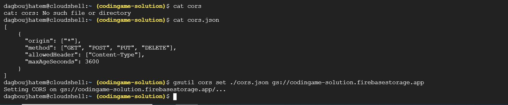

# 📘 Configuration CORS pour un bucket Google Cloud Storage

Ce guide vous explique comment activer **CORS (Cross-Origin Resource Sharing)** pour un bucket de stockage sur Google Cloud en utilisant le terminal Cloud Shell.

---

## ✅ Prérequis

- Un projet Google Cloud avec la facturation activée.
- Un bucket de stockage existant.
- Les autorisations nécessaires pour modifier la configuration du bucket.

---

## 🛠️ Étapes

### 1. Ouvrir la console Google Cloud

- Rendez-vous sur : [https://console.cloud.google.com](https://console.cloud.google.com)
- Sélectionnez votre projet.

### 2. Ouvrir le terminal (Cloud Shell)

- Cliquez sur l'icône du terminal (Cloud Shell) en haut à droite de la console.

### 3. Créer le fichier de configuration CORS

```bash
touch cors.json
```

### 4. Modifier le fichier

Ouvrez-le avec un éditeur comme `vim` ou `vi` ou `nano` ou bien `code` :

```bash
nano cors.json
```
Puis collez-y ce contenu :

```json
[
  {
    "origin": ["*"],
    "method": ["GET", "HEAD", "PUT", "POST", "DELETE"],
    "maxAgeSeconds": 3600
  }
]

```

**NOTE:** En production, remplacez "*" par votre domaine réel (ex : "https://codingamesolutions.com").

### 5. Appliquer la configuration CORS au bucket:

Remplacez `your-bucket-name` par le nom de votre bucket :

```bash
gsutil cors set cors.json gs://your-bucket-name
# Exemple 
gsutil cors set ./cors.json gs://codingame-solution.firebasestorage.app
```

Vous devez avoir ceci : 



**NOTE:** Vous pouvez utiliser ce commande pour avoir la liste des buckets: 

```bash
# En local using 
gcloud auth login
gsutil ls
# Si vous etes en GCP Terminal 
gcloud storage buckets list
```

### 6. Vérifier la configuration

```bash
# En local using 
gsutil cors get gs://your-bucket-name
gsutil cors get gs://codingame-solution.firebasestorage.app
# Si vous etes en GCP Terminal (check all config)
gcloud storage buckets list
```


### Utils Script: 

Script complet pour lister la configuration CORS de tous les buckets: 

```bash
for bucket in $(gcloud storage buckets list --format="value(name)"); do
  echo "CORS config for bucket: $bucket"
  # gsutil cors get gs://"$bucket"
  # Ou bien en utilisant JQ (must install JQ using : sudo apt install jq)
  gcloud storage buckets describe gs://"$bucket" --format="json" | jq '.cors_config'
  echo "-------------------------"
done
```