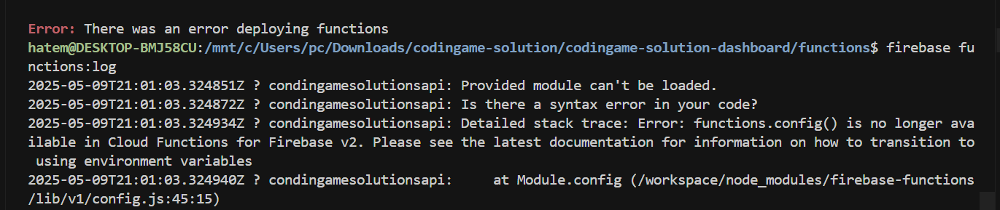

# Firebase Functions Setup Guide

This guide will help you set up Firebase Functions in your Angular project, initialize it, and deploy the functions to Firebase.

## Prerequisites

Before you begin, ensure that you have the following:

- Node.js installed (preferably version 16.x or later).
- Firebase CLI installed. If you don't have it, install it with the following command:

```bash
  npm install -g firebase-tools
 ```

 A Firebase project. If you don't have one, you can create a new project from the Firebase Console.

 ## 1. Initialize Firebase Functions in your Project
Follow these steps to initialize Firebase Functions in your project:
1. **Navigate to your project directory:**
```bash
  cd /path/to/your/project
 ```
 2. **Run Firebase initialization:**
 In your project directory, run the following command to start the Firebase initialization process:
 ```bash
  firebase init
 ```
This command will prompt you to select the Firebase services you want to use. Here's how to proceed:
- **Select Functions**: Use the arrow keys to select Functions and press space to enable it.
- **Choose Firestore (optional)**: If you need Firestore, select it as well.
- **Choose Hosting (optional)**: If you want to host a frontend (e.g., Angular app), select Hosting.
- **Choose Emulators (optional)**: If you want to test your functions locally, select Emulators.
- **Select your Firebase project**: Choose your Firebase project or create a new one.
- **Choose JavaScript or TypeScript** for writing your functions.
 3. **Install dependencies:**
After the Firebase CLI initializes your functions, it will install the necessary dependencies using npm.
 ```bash
cd functions
npm install
 ```
4. **Set up Firebase Functions:**
Firebase will create a `functions` folder in your project directory. Inside the `functions` folder, you will find an `index.js` (or `index.ts` if you chose TypeScript) file. This is where you will define your cloud functions.

Example function:
 ```javascript
const functions = require("firebase-functions");

// Sample HTTP Function
exports.helloWorld = functions.https.onRequest((request, response) => {
  response.send("Hello from Firebase!");
});
 ```
## 2. Testing Functions Locally
You can use Firebase Emulator Suite to test your functions locally.

1. **Install the Firebase Emulator:**

To install the emulator suite, run the following command in your project:
 ```bash
firebase emulators:start
firebase emulators:start --only functions
firebase emulators:start --only functions,firestore
 ```
This will run your functions locally and you can access them at `http://localhost:5000`.
## 3. Deploying Firebase Functions
Once your functions are ready, you can deploy them to Firebase with the following command:

1. **Deploy Functions:**

Run the following command to deploy your functions to Firebase:
 ```bash
firebase deploy --only functions
firebase deploy --only functions:addMessage,functions:makeUppercase
firebase deploy --only functions:condingameSolutionsApi --dry-run
 ```
This command will upload your functions to Firebase and deploy them to the cloud.

2. **Confirm Deployment:**

After deployment, you should see the function URL in the console output. You can also check your functions from the Firebase Console.
## 4. Updating Functions

When you make changes to your functions, follow these steps to redeploy them:

1. **Update your functions** by modifying the code in the `functions/index.js` (or `index.ts`) file.

2. **Redeploy your functions:**
 ```bash
firebase deploy --only functions
# To see logs
firebase functions:log
 ```
 This will deploy the updated functions to Firebase.

## 5. Delete a Firebase function
 ```bash
firebase functions:delete <functionName>
 ```
 Example: 

 ```bash
firebase functions:delete condingameSolutionsApi
 ```

You can also, delete All Functions in a Region: 
```bash
firebase functions:delete condingameSolutionsApi --region <region>
 ```

If you want to deploy to a different region, just replace '`europe-west9`' with the desired. Some available regions include:
- `us-central1` (default)
- `europe-west1` (Belgium)
- `europe-west9` (Paris)
- `asia-northeast1` (Tokyo)
## 6. Verify the Function Region

To check where your functions are deployed, you can look in the Firebase Console (Functions > Your Function), or run the following command to list all your deployed functions:

```bash
firebase <command> --help
firebase functions --help
 ```

## 7. Additional help with a specific Firebase command 

```bash
firebase functions:list
firebase functions:list --region us-central1
 ```

## 8. Additional Configuration (Firebase Functions v2 → functions.config() is deprecated)

If you need to configure environment variables for your Firebase functions, you can do so with the Firebase CLI:

- **Set environment variables:**
 ```bash
firebase functions:config:set someservice.key="value"
 ```
 Example: 

```bash
firebase functions:config:set stripe.secret="YOUR_STRIPE_SECRET_KEY"
 ```
 - **Verify the Configuration**

You can verify that the configuration has been set correctly by running:

```bash
firebase functions:config:get
 ```
- **Access environment variables in your code:**
 ```javascript
const functions = require('firebase-functions');
const someKey = functions.config().someservice.key;
 ```
 - **Delete a Specific Config Value**

If you want to **delete** a Firebase function config value that you previously set using `functions:config:set`, you can use the following command:

 ```bash
firebase functions:config:unset custom
firebase functions:config:unset custom.region
 ```
- The first command can be used to remove all values inside custom
- The second command removes only the `custom.region` key.

 - **Run Function in emulators**
 Run this command in `functions` folder, in order to export `runtimeconfig.json` :

```bash
firebase functions:config:get > .runtimeconfig.json
 ```

After that, you can run the emulators:

 ```bash
firebase emulators:start --only functions
# OR
firebase emulators:start --only functions,firestore,storage,auth
# OR 
# You can export emulator data
firebase emulators:export ./functions/saved_data
# After that, run the emulator with importing data
firebase emulators:start --import=./functions/saved_data --only functions,firestore,storage,auth
 ```

## 9. Additional Configuration (Recommended for setting the env. variables)

If you use `functions:config`, this way is deprecated in V2 of Firebase Functions. Look that: 



So you can use the **Firebase Secrets Manager**, in this case you can use this command to define secret variable: 

 ```bash
 firebase functions:secrets:set STRIPE_SECRET
 ```

After that, you can use this code to access to the secret:

 ```javascript
 import { defineSecret } from 'firebase-functions/params';
const stripeSecret = process.env.STRIPE_SECRET || defineSecret('STRIPE_SECRET');
 ```
 - View an Existing Secret: 
 ```bash
firebase functions:secrets:get STRIPE_SECRET
 ```
 - Delete a Secret: 
 ```bash
firebase functions:secrets:destroy STRIPE_SECRET
 ```

## Troubleshooting: 
- **"Error: Not in a Firebase app directory (could not locate firebase.json)"**: Ensure you are running the `firebase init` command in the correct directory where your `firebase.json` file exists.
- **Permission issues**: Make sure you have the appropriate Firebase project permissions and that you are logged into Firebase CLI using `firebase login`.

## Conclusion :
You have successfully set up and deployed Firebase Functions in your Angular project. You can now build serverless backend logic using Firebase Functions!

If you need more help, check out the [Firebase Functions documentation](https://firebase.google.com/docs/functions?hl=fr).

### Explications :

- Ce `README.md` fournit un guide complet pour initialiser, tester et déployer des fonctions Firebase dans votre projet.
- Vous trouverez des sections sur la configuration des fonctions, leur déploiement, la gestion des variables d'environnement et le test local avec Firebase Emulator.
